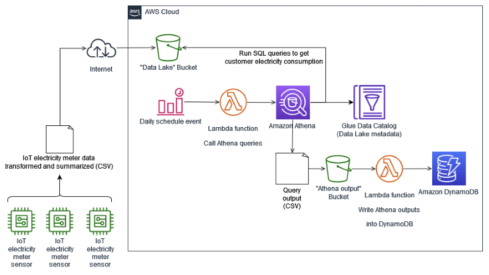
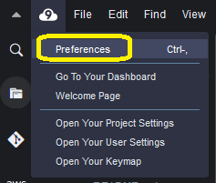

# IoT Analytics - Amazon Athena - Amazon DynamoDB



Repository of artifacts for the solution proposed on Blog Post **Writing results from an Athena query output to Amazon DynamoDB**.

The solution presents a reference architecture to analyze electricity data from smart meters, for maintenance purposes of a hypothetical Energy company, and for self-service analysis of customers, to understand how much electricity they consume.

## Prerequisites

To deploy and use this solution, you should have the following:
- An <a href="https://portal.aws.amazon.com/gp/aws/developer/registration/index.html?nc2=h_ct&src=header_signup" target="_blank">AWS account</a>.
- An <a href="https://aws.amazon.com/iam/" target="_blank">AWS Identity and Access Management (IAM)</a> user, with enough privileges to access resources used in this solution and to run commands from <a href="https://docs.aws.amazon.com/serverless-application-model/latest/developerguide/serverless-sam-cli-install.html" target="_blank">AWS SAM CLI</a>. To create the proper permissions for this user, verify how to <a href="https://docs.aws.amazon.com/IAM/latest/UserGuide/access_controlling.html" target="_blank">control access to AWS resources using policies</a> and the needed <a href="https://docs.aws.amazon.com/serverless-application-model/latest/developerguide/sam-permissions.html" target="_blank">permission for AWS SAM CLI</a>.
- An <a href="https://aws.amazon.com/cloud9/" target="_blank">AWS Cloud9</a> environment, launched as an <a href="https://docs.aws.amazon.com/AWSEC2/latest/UserGuide/AMIs.html#amazon-linux" target="_blank">Amazon Linux 2</a> platform, which holds the needed tools used to deploy this solution: <a href="https://aws.amazon.com/cli/" target="_blank">AWS CLI</a>, AWS SAM CLI, <a href="https://www.docker.com/" target="_blank">Docker engine</a> and <a href="https://www.python.org/downloads/" target="_blank">Python 3</a>. Follow the instructions to <a href="https://docs.aws.amazon.com/cloud9/latest/user-guide/create-environment-main.html#create-environment-console" target="_blank">create an EC2 environment</a> and <a href="https://docs.aws.amazon.com/cloud9/latest/user-guide/open-environment.html" target="_blank">open it</a> to start working.
- A basic understanding of ***bash***, ***Python*** programing and ***SQL*** statements.

## Deploy the solution

**NOTE**: the current versions of some needed tools deployed with the **AWS Cloud9** environment are outdated and won’t be able to fully address the installation process. You need the following versions of mentioned tools to work properly:
- **AWS CLI** version **2**
- **AWS SAM CLI** version **1.40.0** or above

To properly install the solution, do the following in this environment:
- Upgrade the **AWS CLI** version 1 to version 2. Follow the <a href="https://docs.aws.amazon.com/cli/latest/userguide/cliv2-migration-instructions.html" target="_blank">AWS CLI version 2 migration instructions</a> to complete this task.
- Upgrade the **AWS SAM CLI** version installed by default. Follow the instructions for <a href="https://docs.aws.amazon.com/serverless-application-model/latest/developerguide/serverless-sam-cli-install-linux.html#serverless-sam-cli-install-linux-upgrading" target="_blank">upgrading</a> the **AWS SAM CLI**.

To deploy the ***AWS SAM-based*** solution, make sure you completed the previous prerequisites. Then follow these steps:
1. On the **AWS Cloud9** console, select the environment you created previously and choose ***Open IDE***.
2. In the IDE window opened, click on the **AWS Cloud9** icon in the top menu bar and select ***Preferences***.



3. In the opened tab, choose ***AWS Settings*** at the left panel. In the section ***Credentials***, turn off the option ***AWS managed temporary credentials***.


 
4. Close the ***Preferences*** tab and, in the console panel, click on the **“+”** sign and choose ***New Terminal***.


5. In the opened terminal window, run the following **AWS CLI** command, to configure the credentials of the **IAM** user created for this installation, with the needed privileges:

```bash
aws configure
```
In the prompts showed during the configuration, fill them with these values:
- **AWS Access Key ID**: enter your **IAM** user access key
- **AWS Secret Access Key**: enter your **IAM** user secret access key
- **Default region name**:  enter the same **AWS** Region of the **AWS Cloud9** environment used
- **Default output format**: press ***\<ENTER\>***

7. Clone the solution artifacts from this ***GitHub*** repo:
 
```bash
git clone https://github.com/aws-samples/iot-analytics-athena-ddb.git
```

8. Move to the bash scripts directory:

```bash
cd ./iot-analytics-athena-ddb/scripts/bash
```

9. Run the following bash script, to deploy and setup the solution:

```bash
./deploy-solution.sh
```
The content of this script can be visualized in <a href="/scripts/bash/deploy-solution.sh" target="_blank">this link</a>.
During the deployment process, this script will ask you to insert or confirm some configuration parameters. Fill them with these values:
- **Stack Name [sam-iot-analytics]**: press ***\<ENTER\>***
- **AWS Region**: press ***\<ENTER\>*** (the deployment will use the same **AWS** Region of the **AWS Cloud9** environment used)
- **Confirm changes before deploy [y/N]**: N
- **Allow SAM CLI IAM role creation [Y/n]**: Y
- **Disable rollback [y/N]**: N
- **Save arguments to configuration file [Y/n]**: Y
- **SAM configuration file [samconfig.toml]**: press ***\<ENTER\>***
- **SAM configuration environment [default]**: press ***\<ENTER\>***

When the deployment finishes, an <a href="https://aws.amazon.com/cloudformation/" target="_blank">AWS CloudFormation</a> stack is created. Open this service in the AWS Management Console and select the stack named **sam-iot-analytics**. Then, select the ***Resources*** tab, like in the below example:


The above stack creates several resources used by this solution, which are described in the Blog Post.

## Usage

This **AWS SAM** application builds and deploy two <a href="https://aws.amazon.com/lambda/" target="_blank">AWS Lambda</a> functions, needed to automate this ***IoT*** analytical solution:
1. One function called `fn-run-athena-query`, that runs an <a href="https://aws.amazon.com/athena/" target="_blank">Amazon Athena</a> query to summarize the electricity meter data uploaded to **S3** bucket `iot-analytic-bucket-{AWS Account ID}-{AWS Region}`. You can see the code for this function in <a href="/sam-iot-analytics/fn-run-athena-query/fn-run-athena-query.py" target="_blank">this link</a>. It is triggered by an <a href="https://aws.amazon.com/eventbridge/" target="_blank">Amazon EventBridge</a> rule, named `RunAthenaQuerySchedule`, defined with type *“Event Schedule”*:


Notice this rule is disabled for simulation purposes, to test the solution. In a regular operation, this rule triggers the **Lambda function** to run every day at *03h30 UTC*, or *00h30 GMT-3*, in the local time zone tested:


This **Lambda function** has two ***Environment variables*** configured:
- One called `ev_athena_output_location`, which receives the value of the **S3** URI location of the bucket that receives the outputs of **Athena** queries.
- Another called `ev_date_run`, which receives the date of electricity metered data to process, in the format ***YYYY/MM/DD***. If the value received is *“0000/00/00”*, it means the **Lambda function** was triggered by **EventBridge** rule `RunAthenaQuerySchedule`, and the date processed will be the day before the triggering of this **Lambda function**.
You can verify the value of these variables in the ***Configuration*** tab for this function, at the **Lambda console**:


During the simulation, this **Lambda function** will generate files being stored in **S3** bucket `iot-athena-results-{AWS Account ID}-{AWS Region}`. To verify these files content, do the following:

- Open a new tab on the **S3** console, to verify the content of bucket `iot-athena-results-{AWS Account ID}-{AWS Region}`. Select the ***Objects*** tab. Confirm the creation of the prefix `electricity_by_period/`:


- Still in the **S3** console tab, select the prefix `electricity_by_period/` in the objects list and see its content. Verify there are several files in it, with extensions `.metadata` and `.csv`:


These *CSV* files contain the results of the **Athena** queries run by **Lambda function** `fn-run-athena-query`, invoked by the bash script `invoke-fn-run-athena-query-dates.sh`. These specific outputs were generated by queries returning consumed energy data by customer, grouped by hour, month and day-of-month.

- Download one of these *CSV* files and open it with an editor. An excerpt from its content will look like this one:

```
"customerid","sensorid_hour","total_kwh"
"10027610","51246501-2022-01-25T00","0.22"
"10027610","51246501-2022-01-25T01","0.22"
"10027610","51246501-2022-01-25T02","0.23"
"10027610","51246501-2022-01-25T03","0.23"
"10027610","51246501-2022-01-25T04","0.23"
...
```

In this case, it’s an output with data grouped by hour.

2. Another function called `fn-write-athena-output-to-ddb`, that will read the output of an **Athena** query - which is written to **S3** bucket `iot-athena-results-{AWS Account ID}-{AWS Region}`, as a *CSV* file - and will write each line of this file as an item into <a href="https://aws.amazon.com/dynamodb/" target="_blank">Amazon DynamoDB</a> table `ElectricityMeteredByPeriod`. You can see the code for this function in <a href="/sam-iot-analytics/fn-write-athena-output-to-ddb/fn-write-athena-output-to-ddb.py" target="_blank">this link</a>.

## Getting statistics with PartiQL

Every time a new query output *CSV* file is generated in bucket `iot-athena-results-{AWS Account ID}-{AWS Region}`, the **Lambda function** `fn-write-athena-output-to-ddb` is triggered, writing the content of the query output *CSV* file to **DynamoDB** table `ElectricityMeteredByPeriod`.

In this table, you have consumed energy data by customer, grouped by hour, month and day-of-month. With this approach, aggregated data can be accessed by different queries as required, so users can see their readings by hour, day or month in a dashboard, having efficient queries instead of having to aggregate the data every time they access the dashboards.

As an example, we can run <a href="https://docs.aws.amazon.com/amazondynamodb/latest/developerguide/ql-reference.html" target="_blank">PartiQL</a> queries to simulate statistics a customer or the Energy company can obtain from consumed energy in specific periods.

Let's run one query, as an example:

1. Go to the **DynamoDB** console.
2. In the left panel menu, select **PartiQL editor**.
3. In the editor, write the following query:

```sql
SELECT "CustomerID", "SensorID-Period", "kWh-Amount"
	FROM "ElectricityMeteredByPeriod" 
    WHERE "CustomerID" = 10027610
      AND "SensorID-Period" BETWEEN '51246501#2022-01-05T18' AND '51246501#2022-01-05T23'

```
The above query returns the hourly kWh consumed by customer with **ID** *10027610*, on *2022-01-05*, from **6h00 PM** until **11h00 PM**:

The obtained result should be similar to the below screenshot:

```
CustomerID	SensorID-Period	        kWh-Amount
----------  ----------------------  ----------
10027610	51246501#2022-01-05T18	0.28
10027610	51246501#2022-01-05T19	0.29
10027610	51246501#2022-01-05T20	0.3
10027610	51246501#2022-01-05T21	0.3
10027610	51246501#2022-01-05T22	0.29
10027610	51246501#2022-01-05T23	0.27
```

Take a look in <a href="/scripts/partiql/partiql_examples.sql" target="_blank">this link</a> for additional examples of queries you can use to obtain such statistics.

## Cleaning up

To avoid unnecessary charges (storage and computing costs), move to the directory where the bash scripts were deployed (`<deployment path>/iot-analytics-athena-ddb/scripts/bash`).

Then, run this bash script:

```bash
./undeploy-solution.sh
```

The above script will run the following tasks:
- Disable server access logging on *“IoT Data Lake”* and *“Athena results”* buckets.
- Drop the database `iotanalyticsdb` at <a href="https://docs.aws.amazon.com/glue/latest/dg/components-overview.html#data-catalog-intro" target="_blank">AWS Glue Data Catalog</a>, together with the external tables.
- Delete all objects in the deployed **S3** buckets.
- Undeploy **AWS SAM** application `sam-iot-analytics`.

The content of this script can be visualized in <a href="/scripts/bash/undeploy-solution.sh" target="_blank">this link</a>.

During this process, this script will ask you to insert or confirm some configuration parameters. Fill them with these values:
- **Are you sure you want to delete the stack sam-iot-analytics in the region us-west-2? [y/N]**: Y
- **Are you sure you want to delete the folder sam-iot-analytics in S3 which contains the artifacts? [y/N]**: Y

After removing **AWS SAM** application `sam-iot-analytics`, delete the **AWS Cloud9** environment created to deploy this solution. Follow the instructions on page <a href="https://docs.aws.amazon.com/cloud9/latest/user-guide/delete-environment.html" target="_blank">Deleting an environment in AWS Cloud9</a>, to do so.

## Security

See [CONTRIBUTING](CONTRIBUTING.md#security-issue-notifications) for more information.

## License

This library is licensed under the MIT-0 License. See the LICENSE file.
